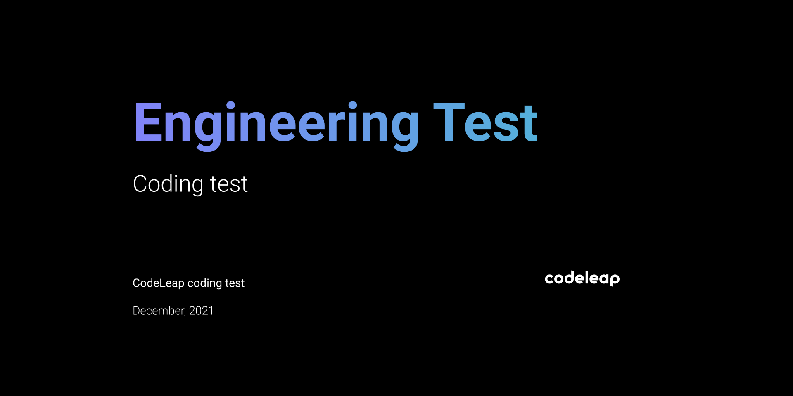

<h1 align="center">CODELEAP -JUNIOR FRONT-END DEVELOPER</h1>

<p align="center">
	
</p>

The purpose of the test is to create a very simple application that will perform basic CRUD functions.

[DEMO DO APP]()

## **Installation**

Use a package manager of your choice (npm, yarn, etc.) in order to install all dependencies

```
# Clone repository github
git clone https://github.com/nivaldoandrade/codeleap-test-junior-fontend

#Install dependencies with Yarn
yarn 
```

## **Usage**

Just `dev` start script.

```
yarn dev
```


## **Techs**
- [ReactJS;](https://reactjs.org/)
- [Typescript.](https://www.typescriptlang.org/)
- [Vite.js;](https://vitejs.dev/)
- [Axios;](https://axios-http.com/docs/intro)
- [Iconify/react;](https://iconify.design/)
- [React Modal;](https://github.com/reactjs/react-modal)
- [React Query;](https://react-query.tanstack.com/)
- [React Router Dom;](https://github.com/remix-run/react-router)
- [Redux;](https://redux.js.org/)
- [Redux Persist;](https://github.com/rt2zz/redux-persist)
- [Styled Components](https://styled-components.com/)
- [Polished;](https://polished.js.org/)
- [Date-fns.](https://date-fns.org/)

### **Um pequeno aprendiz nesse grande mundo da programação.** 😃🗺
